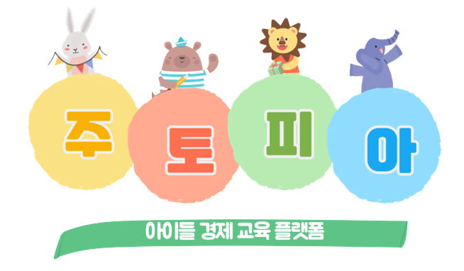
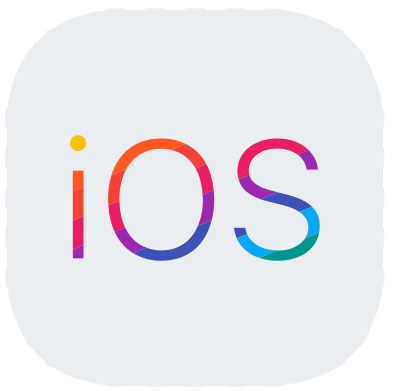
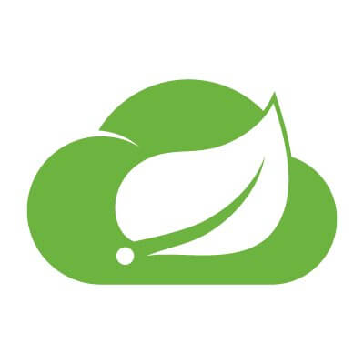
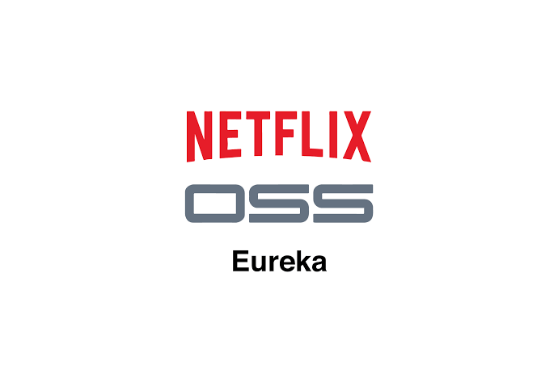
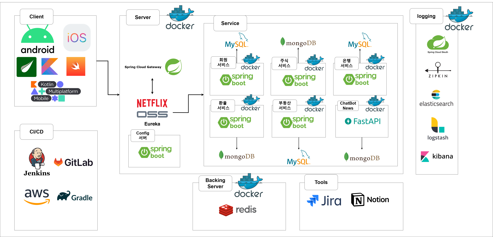
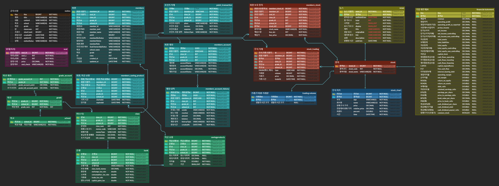
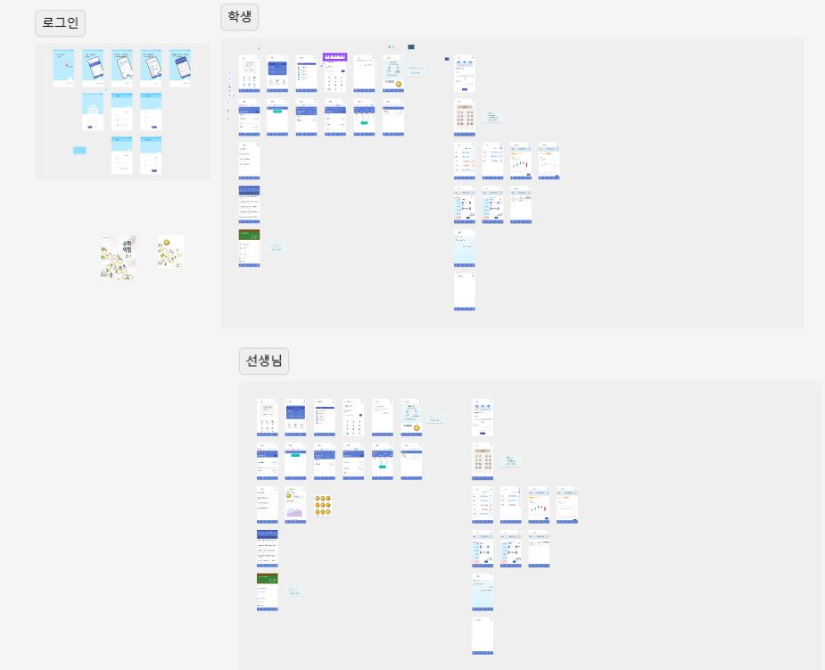

# 🧸주토피아

  
아이들 경제 교육 플랫폼

   

---

# 🎃서비스 소개

주토피아는 어린이를 위한 조기 경제교육 서비스 플랫폼 입니다.

아이들이 실시간 주식을 통해 경제 흐름을 알게 합니다. 

뉴스, 챗봇 서비스로 현 경제 상황에 대해 배웁니다.

# 👶프로젝트 소개

- 진행 기간 : 2023.08.21 ~ 2023.10.06

### 📂 저장소

- **[🔎 Front-end 저장소](./jutopia_kmm)**
- **[🔎 Back-end 저장소(회원 서버)](./jutopia/member-server/)**
- **[🔎 Back-end 저장소(주식 서버)](./jutopia/stock-server/)**
- **[🔎 Back-end 저장소(챗봇 서버)](./jutopia/chat-server/)**
- **[🔎 Back-end 저장소(반 서버)](./jutopia/class-server/)**
- **[🔎 Back-end 저장소(뉴스 서버)](./jutopia/news-server/)**
- **[🔎 Back-end 저장소(임대 서버)](./jutopia/rent-server/)**
- **[🔎 Back-end 저장소(관리자 서버)](./jutopia/teacher/)**

## 👨‍🏫 주요 기능

| 기능        | 내용                                                                                                           |
|-----------|--------------------------------------------------------------------------------------------------------------|
| 주식 기능 | 실시간 주식을 가져와 1분 단위로 차트를 보여준다.   관리자는 5가지 대표 종목을 선택하여 반 아이들에게 보여줄 수 있고, 회원은 5가지 종목 내에서 거래가 가능하다. 회원은 주식을 매수/매도를 할 수 있고 보유 주식을 확인 할 수 있다. |
| 반 기능     | 회원들은 본인 반에 대한 정보를 확인 할 수 있다.  반에서 제공하는 적금 상품을 조회 할 수 있고, 가입까지 가능하다. |
| 임대 기능  | 회원은 본인 반의 자리표를 보고 자리를 임대해야 한다. 보유하고 있는 포인트로 임대를 하여 자리를 선착순으로 선점할 수 있다. |
| 챗봇 기능  | 회원은 어려운 주식 용어 및 뉴스요약을 챗봇과 대화를 통해 정보를 얻을 수 있다. |
| 뉴스 기능 | 주식종목과 관련된 실시간 뉴스를 크롤링 하여 제공한다. |

## 👩‍🏫 기술 스택

### Front-end

|  |  |  |  |  |  |
|:------------:|:----------------:|:----------------:|:-----------------:|:---------------:|:--------------:|
| android | ios | kotlin | Kotlin Multiplatform | Mobile | swift | Thymeleaf |

### Back-end

|  |  |  |  |  |  |
|:-------:|:-------:|:-------:|:-------:|:-------:|:-------:|
| java17 | spring boot | spring cloud | netflix Eureka | MySQL | H2 | 

|  |  |  |  |  |  |
|:-----:|:-----:|:-----:|:-----:|:-----:|:------:|
| redis | python | FastAPI | mongoDB | SKT-AI : KoBART | OpenAI |

### DevOps & Tools & logging

|  |  |  |  |  |  |  |  |
|:-------:|:---------:|:---------:|:---------:|:---------:|:---------:|:---------:|:---------:|
| jenkins | docker | AWS EC2 | gradle | Jira | Slack | zipkin | rabbitMQ | 

---

### 아키텍쳐

### ERD

### MockUp

※ 이미지 클릭시 Figma 이동

---

# 😺 주토피아 주요 서비스

##  Main

## 👨‍👩‍👧‍👦팀 소개

<table align="center">
    <tr align="center">
        <td style="min-width: 150px;">
            <a href="https://github.com/youngseobso">
              
               
              <b>youngseobso</b>
            </a>
        </td>
        <td style="min-width: 150px;">
            <a href="https://github.com/bellringstar">
              
               
              <b>bellringstar</b>
            </a> 
        </td>
        <td style="min-width: 150px;">
            <a href="https://github.com/hans0537">
              
               
              <b>hans0537</b>
            </a> 
        </td>
        <td style="min-width: 150px;">
            <a href="https://github.com/phabala">
              
               
              <b>phabala</b>
            </a> 
        </td>
        <td style="min-width: 150px;">
            <a href="https://github.com/dhkim6956">
              
               
              <b>dhkim6956</b>
            </a> 
        </td>
        <td style="min-width: 150px;">
            <a href="https://github.com/passionhuman">
              
               
              <b>passionhuman</b>
            </a> 
        </td>
    </tr>
    <tr align="center">
        <td>
            소영섭 (팀장) BE & INFRA
        </td>
        <td>
            김현종 (부팀장) BE & FE
        </td>
        <td>
            신성주 BE & INFRA
        </td>
        <td>
            김기홍 BE & INFRA
        </td>
        <td>
            김도훈 FE
        </td>
        <td>
            임준환 FE
        </td>
    </tr>
</table>

## 노션 활용

※ 이미지 클릭시 Notion 이동 
